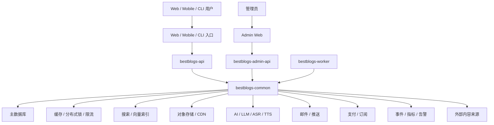

# BestBlogs 技术架构与外部依赖概览

更新时间：2026-07-08

> 本文是公开同步版依赖概览，只描述系统边界、依赖类别和降级原则。真实拓扑、节点数量、内网地址、供应商账号、成本账单、监控配置和单点故障细节不在公开文档中维护。

## 一、系统边界

BestBlogs 由以下主要组件组成：

| 组件 | 角色 |
| --- | --- |
| bestblogs-app | 公开网站和用户 Web 端 |
| bestblogs-admin | 管理后台 |
| bestblogs-api | 用户 API、鉴权、Pro、阅读和个性化能力 |
| bestblogs-admin-api | 管理 API、内容处理和后台任务宿主 |
| bestblogs-common | 共享领域模型、配置、Adapter 和基础设施 |
| bestblogs-worker | 可独立运行的后台任务模块 |
| bestblogs-mobile | iOS / Android 客户端模块（当前暂缓） |
| dujian-app | 读见，后续国内部署版本和中文呈现形态 |
| bestblogs-cli | CLI 与 Agent-friendly 调用入口 |
| bestblogs-skills | Agent Skills 包装层 |

## 二、逻辑架构

## 三、依赖类别

### 3.1 数据与缓存

| 类别 | 用途 | 降级原则 |
| --- | --- | --- |
| 主数据库 | 用户、内容、订阅、Pro、配置、任务状态 | 强依赖，缺失时核心服务不可用 |
| 缓存 / 分布式锁 | 热点缓存、限流、Job 互斥、短期状态 | 强到中依赖；关键链路需要明确 fail-open / fail-closed |
| 搜索 / 向量索引 | 混合搜索、相似内容、向量召回 | 可选增强，默认应可通过 Feature Flag 降级 |

### 3.2 AI 与内容处理

| 类别 | 用途 | 降级原则 |
| --- | --- | --- |
| LLM | 内容分析、摘要、翻译、AI 伴读、推荐解释 | 核心 AI 能力依赖；失败时应给出友好降级 |
| Embedding | 向量化、相似内容、混合检索 | 可选增强，关闭后不影响基础阅读 |
| ASR | 播客 / 视频转录 | 影响音视频理解链路，不影响文章阅读 |
| TTS | 早报音频和播客化输出 | 影响音频体验，文字早报应继续可用 |
| Workflow 编排 | 内容处理流水线 | 需要有失败记录、重试和人工介入路径 |

### 3.3 内容来源

| 类别 | 用途 | 降级原则 |
| --- | --- | --- |
| RSS / Atom | 文章和播客主来源 | 单源失败不影响全站 |
| Newsletter | 邮件类内容来源 | 失败时保留其它来源 |
| 社交平台 | 线程、动态和关注关系 | 依赖用户授权或外部 API，可功能级关闭 |
| 视频平台 | 视频内容和转录来源 | 单平台失败不影响文章 / 播客 |
| 用户私有来源 | 个人订阅流 | 不得进入公共质量池 |

### 3.4 用户能力依赖

| 类别 | 用途 | 降级原则 |
| --- | --- | --- |
| 邮件 | 登录验证、早报、订阅通知 | 登录类邮件属于高优先级，需要稳定兜底 |
| 支付 / 订阅 | Web Pro 购买和权益同步；Mobile 相关链路暂缓 | 必须幂等，失败不能误授或误扣权益 |
| 第三方登录 | Web 登录补充路径；Mobile 相关链路暂缓 | 邮箱或平台主登录应保持可用 |
| 推送 | 运营触达；Mobile Push 暂缓 | 可关闭，不应影响站内主链路 |
| 国内部署形态 | 读见 / dujian-app 的本地化部署与中文呈现 | 不复制核心业务真相，复用主服务边界 |
| 用户集成 | Notion、Flomo 等授权同步 | 可选增强，失败不影响阅读 |

### 3.5 可观测性与发布

| 类别 | 用途 | 降级原则 |
| --- | --- | --- |
| 事件分析 | 产品漏斗、实验和运营判断 | 缺失会产生数据盲区，应有 NoOp 降级 |
| 错误追踪 | 客户端和服务端异常定位 | 不影响功能，但影响排障效率 |
| 存活监控 | 外部可用性检查 | 不影响功能，但影响响应速度 |
| CI / CD | 构建、测试、部署 | 发布强依赖，应可人工兜底 |
| Mobile 构建发布 | App 构建、测试和 OTA | 当前暂缓，重启后再纳入发布强依赖 |

## 四、依赖强度

### 强依赖

缺失会影响核心用户功能：

- 主数据库；
- 核心缓存 / 锁；
- 鉴权与加密配置；
- 主要 LLM 能力；
- 登录邮件；
- Pro 支付与权益同步；
- 生产发布链路。

强依赖需要：

- 启动前检查；
- 明确错误提示；
- 监控和告警；
- 灰度和回滚策略。

### 中依赖

缺失影响特定功能，但核心阅读仍可继续：

- ASR / TTS；
- 图片和音频对象存储；
- 部分内容平台；
- 推荐增强能力；
- 事件分析。

中依赖需要功能级关闭或友好降级。

### 弱依赖

缺失不影响主链路：

- 可选用户集成；
- 灾备邮件通道；
- 运营分发工具；
- 部分实验性搜索或推荐能力；
- 非必要第三方登录方式。

弱依赖应做到关闭后入口隐藏或提示稍后再试。

## 五、Skills 层依赖

`bestblogs-skills/` 是对 BestBlogs 能力的薄包装，原则上通过 `bestblogs-cli` 或后端 API 调用平台能力，不直接持有 AI 服务密钥。

Skills 层的设计目标是：

- 复用后端鉴权、配额和审计；
- 不绕过产品边界；
- 不直接访问生产数据库；
- 不把用户隐私或密钥写入 prompt、日志或公开文档。

## 六、公开文档约束

公开文档可以写：

- 依赖类别；
- 架构边界；
- 降级原则；
- 安全和隐私约束；
- 对贡献者有帮助的抽象说明。

公开文档不写：

- 真实 IP、内网域名、SSH 用户、节点数量和拓扑细节；
- 真实环境变量值、密钥名和账号信息；
- 供应商账单、成本明细和合同信息；
- 告警路由、on-call 规则和事故细节；
- 可被用来攻击系统的具体弱点和操作步骤。

## 七、相关文档

- `4-ARCHITECTURE.md` — 系统边界与链路设计
- `7-CONVENTIONS.md` — 开发规范与代码风格
- `11-OPERATIONS.md` — 运维原则、监控、灰度与回滚
- 各组件 `.env.example` — 本地开发变量用途说明
